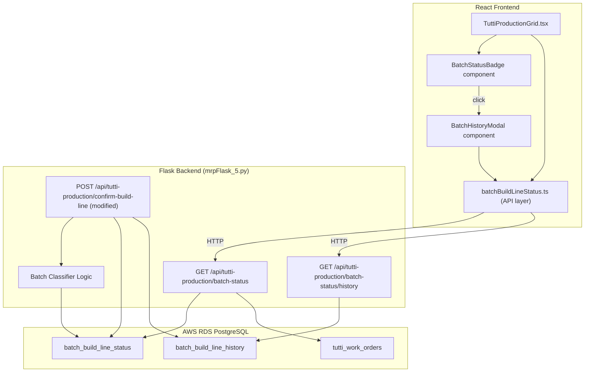
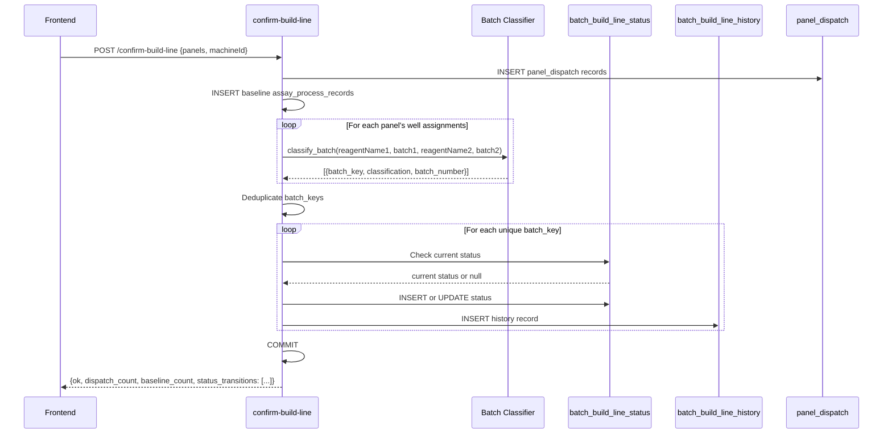

# Design Document: Batch Build-Line Status (建線 Status)

## Overview

This feature adds **batch-level 建線 status tracking** to the Tutti Beads Pre-Assignment system. The key insight is that 建線 status must be tracked per analyze_item **batch** (d_lot, bigD_lot, u_lot), not per lot_code — because multiple lot_codes can reference the same reagent batch. When one lot_code's batch transitions from "未建線" to "已建線", all other lot_codes sharing that batch must reflect the same status.

The implementation spans three layers:
1. **Database** — New `panel_production.batch_build_line_status` and `panel_production.batch_build_line_history` tables
2. **Backend** — New Flask endpoints for status query/history + modifications to the existing `confirm-build-line` endpoint
3. **Frontend** — Status badge components integrated into `TuttiProductionGrid.tsx` with batch-grouped display

## Architecture



### Design Decisions

1. **Batch_Key as composite string** — Format: `{batch_number}::{classification_type}` (e.g., `LOT2024A::d_lot`). Using `::` as separator since batch numbers may contain hyphens. This provides a simple, indexable key without needing a composite primary key lookup.

2. **Separate status + history tables** — The `batch_build_line_status` table holds current state (fast lookup), while `batch_build_line_history` table stores the full audit trail. This avoids scanning history to determine current status.

3. **Status computed on confirm-build-line** — Rather than a separate "update status" endpoint, status transitions are triggered automatically when `confirm-build-line` is called. This follows the existing flow without adding operator steps.

4. **Idempotent classification** — The Batch_Classifier is a pure function with no side effects. Given the same well data, it always produces the same Batch_Key. This simplifies testing and ensures consistency.

5. **Graceful degradation** — If status tracking fails during confirm-build-line, the core panel_dispatch write still succeeds. Status is treated as supplementary metadata.

## Components and Interfaces

### Backend: Batch Classifier

```python
def classify_batch(reagent_name1: str, batch1: str, reagent_name2: str, batch2: str) -> list[dict]:
    """
    Classify well reagents into batch types and return Batch_Keys.
    
    Returns list of dicts: [{"batch_key": str, "classification": str, "batch_number": str}]
    """
    results = []
    if reagent_name1 and batch1:
        if reagent_name1.startswith('t') and len(reagent_name1) > 1 and reagent_name1[1].isupper():
            classification = 'd_lot'
        else:
            classification = 'bigD_lot'
        results.append({
            "batch_key": f"{batch1}::d_lot" if classification == 'd_lot' else f"{batch1}::bigD_lot",
            "classification": classification,
            "batch_number": batch1
        })
    if reagent_name2 and batch2:
        results.append({
            "batch_key": f"{batch2}::u_lot",
            "classification": "u_lot",
            "batch_number": batch2
        })
    return results
```

### Backend Routes

| Method | Endpoint | Description |
|--------|----------|-------------|
| GET | `/api/tutti-production/batch-status?lot_no=X` | Get batch statuses for a work order by lot_no |
| GET | `/api/tutti-production/batch-status?work_order_no=X` | Get batch statuses by work_order_no |
| GET | `/api/tutti-production/batch-status/history?batch_key=X` | Get transition history for a specific Batch_Key |

### Backend: Status Query Response

```python
# GET /api/tutti-production/batch-status?lot_no=1-053054-26060201
{
    "ok": True,
    "lot_no": "1-053054-26060201",
    "batches": [
        {
            "batch_key": "LOT2024A::d_lot",
            "classification": "d_lot",
            "batch_number": "LOT2024A",
            "status": "已建線",
            "modification_count": 0,
            "last_transition_at": "2025-06-15T10:30:00",
            "last_operator": "operator1",
            "analyze_items": ["tCRE-D", "tCREA-D"]
        },
        {
            "batch_key": "LOT2024B::bigD_lot",
            "classification": "bigD_lot",
            "batch_number": "LOT2024B",
            "status": "已改線(1)",
            "modification_count": 1,
            "last_transition_at": "2025-06-16T14:00:00",
            "last_operator": "operator2",
            "analyze_items": ["ALP-D", "QGGT-AD"]
        },
        {
            "batch_key": "LOT2024C::u_lot",
            "classification": "u_lot",
            "batch_number": "LOT2024C",
            "status": "未建線",
            "modification_count": 0,
            "last_transition_at": null,
            "last_operator": null,
            "analyze_items": ["ALP-U", "QGGT-AU"]
        }
    ]
}
```

### Backend: History Query Response

```python
# GET /api/tutti-production/batch-status/history?batch_key=LOT2024B::bigD_lot
{
    "ok": True,
    "batch_key": "LOT2024B::bigD_lot",
    "current_status": "已改線(1)",
    "modification_count": 1,
    "history": [
        {
            "previous_status": "未建線",
            "new_status": "已建線",
            "transitioned_at": "2025-06-15T10:30:00",
            "operator": "operator1",
            "work_order_no": "WO-2025-001",
            "lot_no": "1-053054-26060201"
        },
        {
            "previous_status": "已建線",
            "new_status": "已改線(1)",
            "transitioned_at": "2025-06-16T14:00:00",
            "operator": "operator2",
            "work_order_no": "WO-2025-001",
            "lot_no": "1-053054-26060201"
        }
    ]
}
```

### Frontend Components

#### `BatchStatusBadge.tsx`

```typescript
interface BatchStatusBadgeProps {
  batchKey: string;
  status: '未建線' | '已建線' | string; // '已改線(n)' pattern
  modificationCount: number;
  classification: 'd_lot' | 'bigD_lot' | 'u_lot';
  onClick?: () => void;
}
```

Renders a small pill/badge with:
- Gray background + "未建線" text for not-built
- Green background + "已建線" text for built
- Orange background + "已改線(n)" text for modified
- Classification label prefix (d / D / U) for quick identification
- Cursor pointer + click handler to open history modal

#### `BatchHistoryModal.tsx`

```typescript
interface BatchHistoryModalProps {
  batchKey: string;
  isOpen: boolean;
  onClose: () => void;
}
```

A modal overlay showing:
- Batch_Key header with classification label
- Current status with large badge
- Timeline of transitions (newest first) with timestamp, operator, work order reference
- Close button

#### `batchBuildLineStatus.ts` (API Layer)

```typescript
export interface BatchStatus {
  batch_key: string;
  classification: 'd_lot' | 'bigD_lot' | 'u_lot';
  batch_number: string;
  status: string;
  modification_count: number;
  last_transition_at: string | null;
  last_operator: string | null;
  analyze_items: string[];
}

export interface BatchHistoryEntry {
  previous_status: string;
  new_status: string;
  transitioned_at: string;
  operator: string;
  work_order_no: string;
  lot_no: string;
}

export async function fetchBatchStatuses(lotNo: string): Promise<BatchStatus[]>;
export async function fetchBatchHistory(batchKey: string): Promise<BatchHistoryEntry[]>;
```

### Integration with TuttiProductionGrid

The grid will add a new column group "建線狀態" with three sub-columns:
- **d / D** — Shows the d_lot or bigD_lot batch status badge
- **U** — Shows the u_lot batch status badge

Each cell renderer uses `BatchStatusBadge` with data fetched via `fetchBatchStatuses` keyed to the row's `lot_no`.

## Data Models

### Database Table: `panel_production.batch_build_line_status`

```sql
CREATE TABLE IF NOT EXISTS panel_production.batch_build_line_status (
    id                  SERIAL PRIMARY KEY,
    batch_key           VARCHAR(100) NOT NULL UNIQUE,
    classification      VARCHAR(20) NOT NULL CHECK (classification IN ('d_lot', 'bigD_lot', 'u_lot')),
    batch_number        VARCHAR(50) NOT NULL,
    status              VARCHAR(30) NOT NULL DEFAULT '未建線',
    modification_count  INTEGER NOT NULL DEFAULT 0,
    last_transition_at  TIMESTAMP,
    last_operator       VARCHAR(50),
    created_at          TIMESTAMP DEFAULT NOW(),
    updated_at          TIMESTAMP DEFAULT NOW()
);

CREATE INDEX IF NOT EXISTS idx_batch_status_key
    ON panel_production.batch_build_line_status (batch_key);

CREATE INDEX IF NOT EXISTS idx_batch_status_batch_number
    ON panel_production.batch_build_line_status (batch_number);
```

### Database Table: `panel_production.batch_build_line_history`

```sql
CREATE TABLE IF NOT EXISTS panel_production.batch_build_line_history (
    id                  SERIAL PRIMARY KEY,
    batch_key           VARCHAR(100) NOT NULL,
    previous_status     VARCHAR(30) NOT NULL,
    new_status          VARCHAR(30) NOT NULL,
    modification_count  INTEGER NOT NULL,
    transitioned_at     TIMESTAMP NOT NULL DEFAULT NOW(),
    operator            VARCHAR(50),
    work_order_no       VARCHAR(50),
    lot_no              VARCHAR(50),
    created_at          TIMESTAMP DEFAULT NOW()
);

CREATE INDEX IF NOT EXISTS idx_batch_history_key
    ON panel_production.batch_build_line_history (batch_key, transitioned_at DESC);
```

### Status Transition Logic (Python)

```python
def transition_batch_status(batch_key: str, classification: str, batch_number: str,
                            operator: str, work_order_no: str, lot_no: str) -> dict:
    """
    Perform status transition for a batch_key.
    Returns the new status record dict.
    """
    now = datetime.now()
    
    # Fetch current status
    row = db.session.execute(text("""
        SELECT status, modification_count FROM panel_production.batch_build_line_status
        WHERE batch_key = :key
    """), {'key': batch_key}).fetchone()
    
    if row is None:
        # First time: 未建線 → 已建線
        previous_status = '未建線'
        new_status = '已建線'
        new_count = 0
        db.session.execute(text("""
            INSERT INTO panel_production.batch_build_line_status
                (batch_key, classification, batch_number, status, modification_count,
                 last_transition_at, last_operator, updated_at)
            VALUES (:key, :cls, :bn, :status, :count, :ts, :op, :ts)
        """), {
            'key': batch_key, 'cls': classification, 'bn': batch_number,
            'status': new_status, 'count': new_count, 'ts': now, 'op': operator
        })
    else:
        # Subsequent: 已建線 → 已改線(1), or 已改線(n) → 已改線(n+1)
        previous_status = row[0]
        current_count = row[1]
        new_count = current_count + 1
        new_status = f'已改線({new_count})'
        db.session.execute(text("""
            UPDATE panel_production.batch_build_line_status
            SET status = :status, modification_count = :count,
                last_transition_at = :ts, last_operator = :op, updated_at = :ts
            WHERE batch_key = :key
        """), {
            'key': batch_key, 'status': new_status, 'count': new_count,
            'ts': now, 'op': operator
        })
    
    # Write history record
    db.session.execute(text("""
        INSERT INTO panel_production.batch_build_line_history
            (batch_key, previous_status, new_status, modification_count,
             transitioned_at, operator, work_order_no, lot_no)
        VALUES (:key, :prev, :new, :count, :ts, :op, :wo, :lot)
    """), {
        'key': batch_key, 'prev': previous_status, 'new': new_status,
        'count': new_count, 'ts': now, 'op': operator, 'wo': work_order_no, 'lot': lot_no
    })
    
    return {
        'batch_key': batch_key,
        'previous_status': previous_status,
        'new_status': new_status,
        'modification_count': new_count
    }
```

### Modified confirm-build-line Flow



## Correctness Properties

### Property 1: Batch Classification Determinism

*For any* well data containing `reagentName1`, `batch1`, `reagentName2`, `batch2`, calling `classify_batch` multiple times with the same inputs SHALL always produce the same list of Batch_Keys — the function is deterministic and pure.

**Validates: Requirements 1.4, 1.5**

### Property 2: Classification Partition Completeness

*For any* non-empty `reagentName1` with non-empty `batch1`, `classify_batch` SHALL classify it as exactly one of `d_lot` or `bigD_lot` (never both, never neither). *For any* non-empty `reagentName2` with non-empty `batch2`, it SHALL always be classified as `u_lot`.

**Validates: Requirements 1.1, 1.2, 1.3**

### Property 3: Status Transition State Machine

*For any* sequence of N confirm-build-line operations on the same Batch_Key (N ≥ 1):
- After the 1st operation, status SHALL be "已建線" with modification_count = 0
- After the (K+1)th operation (K ≥ 1), status SHALL be "已改線(K)" with modification_count = K

This is a model-based property: the simple state machine `未建線 →[confirm]→ 已建線 →[confirm]→ 已改線(1) →[confirm]→ 已改線(2) → ...` must hold.

**Validates: Requirements 2.3, 2.4**

### Property 4: History Count Matches Transitions

*For any* Batch_Key that has undergone N status transitions, querying its history SHALL return exactly N entries, each with monotonically increasing `transitioned_at` timestamps.

**Validates: Requirements 6.1, 6.2**

### Property 5: Batch Consistency Across Lot Codes

*For any* two lot_codes (L1, L2) whose work order well data references the same batch_number with the same classification, querying batch-status for L1 and L2 SHALL return identical `status` and `modification_count` values for that Batch_Key.

**Validates: Requirements 3.3, 5.5**

### Property 6: Classification Rule — lowercase t detection

*For any* `reagentName1` string, if and only if it starts with lowercase `t` followed by an uppercase letter, the classification SHALL be `d_lot`. Otherwise (including empty string, starts with uppercase `T`, starts with `t` followed by lowercase), the classification SHALL be `bigD_lot`.

**Validates: Requirements 1.1, 1.2**

## Error Handling

### Backend Error Handling

| Scenario | HTTP Status | Response |
|----------|-------------|----------|
| Missing `lot_no` and `work_order_no` on status query | 400 | `{"ok": false, "error": "需提供 lot_no 或 work_order_no 參數"}` |
| Work order not found | 404 | `{"ok": false, "error": "找不到指定工單"}` |
| Missing `batch_key` on history query | 400 | `{"ok": false, "error": "需提供 batch_key 參數"}` |
| Status transition fails during confirm-build-line | 200 | Core dispatch succeeds; `status_errors` array in response lists failed keys |
| Database connection failure | 500 | `{"ok": false, "error": "<exception message>"}` |

### Frontend Error Handling

| Scenario | Behavior |
|----------|----------|
| Batch status fetch fails | Show "—" placeholder in badge cells, log warning |
| History fetch fails | Show error message in modal, allow retry |
| Status shows stale data | After confirm-build-line success, refetch batch statuses |

## Testing Strategy

### Property-Based Tests (Python — Hypothesis)

Appropriate for:
- `classify_batch` function (pure, varies with input, low cost)
- Status transition logic (state machine model)
- History ordering invariant
- Batch consistency across lot_codes (model-based)

**Configuration**: Minimum 100 iterations per property, tagged with feature name.

### Integration Tests (Example-Based)

- Full confirm-build-line → status transition flow
- Status query with multiple lot_codes sharing a batch
- History query after multiple transitions
- Error case: confirm-build-line with invalid data

### Frontend Tests (Example-Based)

- Badge renders correct color/text for each status
- Badge click opens history modal
- Grid shows consistent badges for shared batches
- Status refreshes after confirm-build-line without page reload

### Smoke Tests

- `batch_build_line_status` and `batch_build_line_history` tables exist
- Status query returns valid response for existing work orders
- Classifier correctly handles known reagent names from production data
