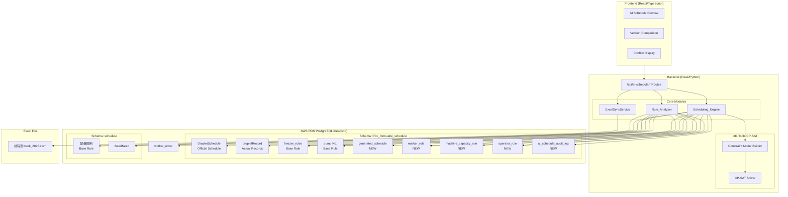
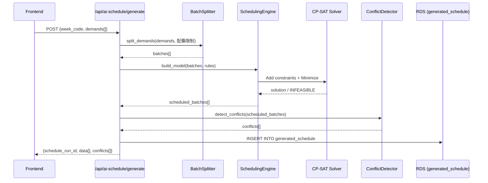

# Design Document: Marker Scheduling AI

## Overview

本設計文件描述 Skyla MRP 系統新增的「AI 排程分析與自動排程」模組。該模組從歷史 Marker 生產排程資料中萃取規則，結合 OR-Tools CP-SAT 約束求解器自動產生排程建議，並提供前端預覽、衝突偵測、版本管理與 Excel 同步功能。

**設計原則：**
- **不破壞**：獨立的 API 路由（`/api/ai-schedule/`）、獨立的資料表，不修改現有系統
- **分層解耦**：Rule_Analyzer（規則分析）與 Scheduling_Engine（排程求解）職責分離
- **Base Rule 至上**：衍生規則不得違反基準規則表，排程引擎僅分配基準規則允許的資源
- **Excel 同步解耦**：ExcelSyncService 與 RDS 寫入為獨立交易，Excel 失敗不影響 RDS

**系統邊界：**
- 本模組為新增功能模組，不修改現有 `scheduler_api.py`（V33.31 CP-SAT 排程）的邏輯
- 前端新增 Sidebar 導航項目，不影響現有頁面

## Architecture

### High-Level System Diagram



### Module Architecture

```mermaid
graph LR
    subgraph ai_schedule_module["ai_schedule/ (New Python Package)"]
        direction TB
        init["__init__.py"]
        routes["routes.py<br/>Flask Blueprint"]
        analyzer["rule_analyzer.py<br/>Rule Analysis Logic"]
        engine["scheduling_engine.py<br/>CP-SAT Solver Wrapper"]
        validator["rule_validator.py<br/>Base Rule Validation"]
        batch_splitter["batch_splitter.py<br/>Demand → Batches"]
        excel_sync["excel_sync_service.py<br/>Excel Write Logic"]
        models["models.py<br/>SQLAlchemy Models"]
        conflict["conflict_detector.py<br/>Conflict Detection"]
        ai_advisor["ai_advisor.py<br/>LLM Suggestions"]
    end
```



### Request Flow (排程產生)



## Components and Interfaces

### Backend Components

#### 1. `ai_schedule/routes.py` — Flask Blueprint

```python
from flask import Blueprint

ai_schedule_bp = Blueprint('ai_schedule', __name__, url_prefix='/api/ai-schedule')

# Registered in mrpFlask_5.py:
# app.register_blueprint(ai_schedule_bp)
```

**Endpoints:**

| Method | Path | Description |
|--------|------|-------------|
| POST | `/analyze-rules` | 觸發歷史規則分析 |
| POST | `/generate` | 產生自動排程 |
| GET | `/preview` | 取得排程預覽 |
| PUT | `/update/{id}` | 更新單筆排程 |
| POST | `/confirm` | 確認寫入正式排程 |
| POST | `/validate` | 驗證排程約束 |
| GET | `/suggestions/{id}` | AI 調整建議 |
| GET | `/validation-report` | 規則一致性報告 |

#### 2. `ai_schedule/rule_analyzer.py` — Rule Analysis Module

```python
class RuleAnalyzer:
    """從歷史排程資料萃取 Marker 生產規則"""
    
    def __init__(self, db_session):
        self.db = db_session
    
    def analyze_all(self) -> AnalysisSummary:
        """主入口：分析所有 Marker 規則並寫入衍生規則表"""
        ...
    
    def _load_historical_data(self) -> tuple[pd.DataFrame, pd.DataFrame, pd.DataFrame]:
        """載入 DropletSchedule、dropletRecord、worker_order"""
        ...
    
    def _analyze_marker(self, marker_name: str, records: pd.DataFrame) -> MarkerRuleData:
        """分析單一 Marker 的規則模式"""
        ...
    
    def _validate_against_base_rules(self, derived_rules: list[MarkerRuleData]) -> ValidationReport:
        """驗證衍生規則與基準規則的一致性"""
        ...
    
    def _correct_conflicts(self, conflicts: list[RuleConflict]) -> list[CorrectionResult]:
        """以基準規則為準修正衝突"""
        ...
```

#### 3. `ai_schedule/scheduling_engine.py` — Scheduling Engine

```python
class SchedulingEngine:
    """使用 OR-Tools CP-SAT 求解器產生排程"""
    
    def __init__(self, db_session):
        self.db = db_session
        self.model = None
        self.solver = None
    
    def generate(self, week_code: str, demands: list[dict], 
                 resource_config: dict = None) -> ScheduleResult:
        """主入口：從需求產生排程結果"""
        ...
    
    def _load_rules(self) -> ScheduleRules:
        """載入規則（衍生規則優先，fallback 至基準規則）"""
        ...
    
    def _build_cp_model(self, batches: list[Batch], rules: ScheduleRules,
                        horizon_days: int) -> cp_model.CpModel:
        """建構 CP-SAT 約束模型"""
        ...
    
    def _add_production_flow_constraints(self, model, batch_vars):
        """配藥→滴定→凍乾順序約束"""
        ...
    
    def _add_machine_port_constraints(self, model, batch_vars):
        """Machine_Port 時間互斥約束"""
        ...
    
    def _add_dryer_capacity_constraints(self, model, batch_vars):
        """Freeze_Dryer 容量約束"""
        ...
    
    def _add_operator_constraints(self, model, batch_vars):
        """Operator 準備區間互斥約束"""
        ...
    
    def _add_base_rule_resource_constraints(self, model, batch_vars):
        """資源分配限制在 Base_Rule_Tables 允許範圍"""
        ...
    
    def _solve(self, model) -> list[dict] | None:
        """執行 CP-SAT 求解"""
        ...
```

#### 4. `ai_schedule/batch_splitter.py` — Batch Splitting

```python
class BatchSplitter:
    """根據配藥限制將需求拆分為批次"""
    
    def split_demands(self, demands: list[MarkerDemand], 
                      limits: dict[str, int]) -> list[Batch]:
        """將每個 Marker 需求依配藥限制拆分"""
        ...
    
    def _generate_batch_number(self, pn: str, year: int, week: int, 
                                seq: int, existing_batches: set[str]) -> str:
        """產生唯一 Batch 編號：PN末三碼 + 年末兩碼 + 週數 + 序號"""
        ...
    
    def _generate_work_order(self, year: int, month: int,
                              existing_max_seq: int) -> str:
        """產生工單號碼：TMRA + 年末兩碼 + 三碼月序號"""
        ...
```

#### 5. `ai_schedule/excel_sync_service.py` — Excel Sync

```python
class ExcelSyncService:
    """獨立的 Excel 同步服務，與 RDS 交易解耦"""
    
    EXCEL_PATH = "/home/ubuntu/beads-project/excelData/Excel_data/排程表week_2026.xlsm"
    STATS_AREA_END_ROW = 98
    DAY_SEPARATOR_COL = "H"
    DAY_SEPARATOR_VALUE = "日期:"
    
    def sync_to_excel(self, schedule_entries: list[dict], 
                      target_week: int) -> SyncResult:
        """主入口：將排程結果同步至 Excel"""
        ...
    
    def _find_closest_template_sheet(self, wb: Workbook, 
                                      target_week: int) -> str:
        """找到最靠近目標週的既有 sheet（忽略 (*) 副本）"""
        ...
    
    def _copy_and_rename_sheet(self, wb: Workbook, source_name: str, 
                               target_week: int) -> Worksheet:
        """複製模板 sheet 並重命名"""
        ...
    
    def _fill_day_sections(self, ws: Worksheet, 
                           entries_by_date: dict[str, list[dict]]):
        """填入各日排程資料，動態增減 row"""
        ...
    
    def _map_entry_to_columns(self, entry: dict) -> dict[str, Any]:
        """排程欄位對應 Excel 欄位：H~T"""
        ...
```

#### 6. `ai_schedule/conflict_detector.py` — Conflict Detection

```python
class ConflictDetector:
    """偵測排程結果中的資源衝突"""
    
    def detect_all(self, schedule_entries: list[dict], 
                   rules: ScheduleRules) -> list[Conflict]:
        """偵測所有衝突類型"""
        ...
    
    def _check_machine_port_overlap(self, entries) -> list[Conflict]:
        """檢查 Machine_Port 時間重疊"""
        ...
    
    def _check_dryer_capacity(self, entries, rules) -> list[Conflict]:
        """檢查 Freeze_Dryer 超容"""
        ...
    
    def _check_operator_overlap(self, entries) -> list[Conflict]:
        """檢查 Operator 準備區間重疊"""
        ...
    
    def _check_production_flow(self, entries) -> list[Conflict]:
        """檢查生產流程順序"""
        ...
    
    def _check_base_rule_compliance(self, entries, rules) -> list[Conflict]:
        """檢查資源分配是否符合基準規則"""
        ...
```

### Frontend Components

#### 1. `AISchedulePreview.tsx` — 排程預覽主頁面

```typescript
interface AISchedulePreviewProps {
  onNavigateBack: () => void;
}

// 主要功能：
// - 顯示 generated_schedule 表格（可排序/篩選）
// - 紅色標記衝突項目 + 顯示 conflict_reason
// - 行內編輯：日期、時間、機台、凍乾機、操作員
// - 版本選擇器（schedule_run_id 下拉）
// - 「全部確認」/「逐筆確認」按鈕
```

#### 2. `ScheduleConflictPanel.tsx` — 衝突詳情面板

```typescript
interface ConflictPanelProps {
  scheduleId: number;
  conflicts: Conflict[];
  onResolve: (id: number, resolution: Resolution) => void;
}

// 主要功能：
// - 衝突原因自然語言說明
// - AI 建議的替代方案
// - 一鍵套用建議
```

#### 3. `VersionCompare.tsx` — 版本比較

```typescript
interface VersionCompareProps {
  weekCode: string;
  versions: ScheduleVersion[];
}

// 主要功能：
// - 並排比較兩個版本的排程差異
// - 高亮新增/刪除/修改項目
// - 選擇要確認的版本
```

#### 4. `RuleAnalysisPanel.tsx` — 規則分析結果

```typescript
interface RuleAnalysisPanelProps {
  onTriggerAnalysis: () => void;
  analysisResult: AnalysisSummary | null;
}

// 主要功能：
// - 觸發規則分析按鈕
// - 分析摘要顯示
// - 一致性驗證報告
```

## Data Models

### New Tables (Schema: `P01_formualte_schedule`)

#### `generated_schedule`

| Column | Type | Constraints | Description |
|--------|------|-------------|-------------|
| id | SERIAL | PRIMARY KEY | 自增 ID |
| schedule_run_id | UUID | NOT NULL, INDEX | 排程版本 ID |
| week_code | VARCHAR(10) | NOT NULL, INDEX | 週別代碼 (e.g. "2026-W24") |
| date | DATE | NOT NULL | 排程日期 |
| marker | VARCHAR(100) | NOT NULL | Marker 名稱 |
| machine_port | VARCHAR(20) | | 滴定機台 |
| freeze_dryer | VARCHAR(20) | | 凍乾機 |
| operator | VARCHAR(50) | | 配藥操作員 |
| rd_time | TIME | | R&D 給藥時間 (DrugGivenAt) |
| start_time | TIME | | 開始時間 |
| end_time | TIME | | 結束時間 |
| quantity | INTEGER | | 數量 |
| pn | VARCHAR(20) | | P/N 料號 |
| batch | VARCHAR(30) | UNIQUE | Batch 編號 |
| work_order | VARCHAR(30) | | 工單號碼 |
| notes | TEXT | | 備註 |
| conflict_flag | BOOLEAN | DEFAULT FALSE | 衝突標記 |
| conflict_reason | TEXT | | 衝突原因 |
| priority | INTEGER | DEFAULT 1 | 優先度 (1=W1, 2=W2, 3=W3) |
| status | VARCHAR(20) | DEFAULT 'draft' | 狀態: draft/approved/superseded/confirmed/rollback |
| confirmed_official_id | INTEGER | | 對應 DropletSchedule 寫入 ID |
| created_by | VARCHAR(50) | | 建立者 |
| created_at | TIMESTAMP | DEFAULT NOW() | 建立時間 |
| updated_at | TIMESTAMP | DEFAULT NOW() | 更新時間 |

**Indexes:**
- `idx_gs_run_id` ON (schedule_run_id)
- `idx_gs_week_code` ON (week_code)
- `idx_gs_status` ON (status)
- `idx_gs_batch` UNIQUE ON (batch)

#### `marker_rule`

| Column | Type | Constraints | Description |
|--------|------|-------------|-------------|
| id | SERIAL | PRIMARY KEY | 自增 ID |
| marker_name | VARCHAR(100) | NOT NULL, UNIQUE | Marker 名稱 |
| pn | VARCHAR(20) | | P/N 料號 |
| common_machines | JSONB | DEFAULT '[]' | 常用機台清單 |
| common_dryers | JSONB | DEFAULT '[]' | 常用凍乾機清單 |
| common_operators | JSONB | DEFAULT '[]' | 常用操作員清單 |
| avg_start_time | TIME | | 平均開始時間 |
| avg_end_time | TIME | | 平均結束時間 |
| avg_duration_minutes | INTEGER | | 平均生產時間（分鐘） |
| common_quantities | JSONB | DEFAULT '[]' | 常見數量清單 |
| special_notes | JSONB | DEFAULT '[]' | 特殊規則備註 |
| data_confidence | VARCHAR(10) | CHECK IN ('high','medium','low') | 資料信心度 |
| base_rule_validated | BOOLEAN | DEFAULT FALSE | 是否已通過基準規則驗證 |
| last_analyzed_at | TIMESTAMP | | 最後分析時間 |

#### `machine_capacity_rule`

| Column | Type | Constraints | Description |
|--------|------|-------------|-------------|
| id | SERIAL | PRIMARY KEY | 自增 ID |
| machine_id | VARCHAR(20) | NOT NULL, UNIQUE | 機台 ID |
| machine_type | VARCHAR(10) | CHECK IN ('port','dryer') | 機台類型 |
| max_concurrent | INTEGER | DEFAULT 1 | 最大同時使用數 |
| available_hours_start | TIME | | 可用時段起始 |
| available_hours_end | TIME | | 可用時段結束 |
| maintenance_schedule | JSONB | DEFAULT '{}' | 維護排程 |
| base_rule_validated | BOOLEAN | DEFAULT FALSE | 是否已通過基準規則驗證 |
| last_updated_at | TIMESTAMP | DEFAULT NOW() | 最後更新時間 |

#### `operator_rule`

| Column | Type | Constraints | Description |
|--------|------|-------------|-------------|
| id | SERIAL | PRIMARY KEY | 自增 ID |
| operator_name | VARCHAR(50) | NOT NULL, UNIQUE | 操作員名稱 |
| capable_markers | JSONB | DEFAULT '[]' | 可操作 Marker 清單 |
| max_concurrent_tasks | INTEGER | DEFAULT 1 | 最大同時任務數 |
| available_days | JSONB | DEFAULT '[]' | 可用工作日 |
| shift_start | TIME | | 班次起始 |
| shift_end | TIME | | 班次結束 |
| base_rule_validated | BOOLEAN | DEFAULT FALSE | 是否已通過基準規則驗證 |
| last_updated_at | TIMESTAMP | DEFAULT NOW() | 最後更新時間 |

#### `ai_schedule_audit_log`

| Column | Type | Constraints | Description |
|--------|------|-------------|-------------|
| id | SERIAL | PRIMARY KEY | 自增 ID |
| schedule_run_id | UUID | NOT NULL, INDEX | 排程版本 ID |
| action | VARCHAR(20) | NOT NULL | 動作: confirm/rollback/force_confirm |
| confirmed_by | VARCHAR(50) | | 確認者 |
| confirmed_at | TIMESTAMP | DEFAULT NOW() | 確認時間 |
| entries_count | INTEGER | | 寫入筆數 |
| force_confirm_reason | TEXT | | 強制寫入原因 |
| rollback_at | TIMESTAMP | | 回復時間 |
| rollback_by | VARCHAR(50) | | 回復者 |
| details | JSONB | DEFAULT '{}' | 額外細節（寫入 ID 對應等） |
| created_at | TIMESTAMP | DEFAULT NOW() | 記錄建立時間 |

### SQLAlchemy Model Definitions

```python
# ai_schedule/models.py
from sqlalchemy import Column, Integer, String, Boolean, DateTime, Date, Time, Text, JSON
from sqlalchemy.dialects.postgresql import UUID, JSONB
from flask_sqlalchemy import SQLAlchemy
import uuid

db = SQLAlchemy()

class GeneratedSchedule(db.Model):
    __tablename__ = 'generated_schedule'
    __table_args__ = {'schema': 'P01_formualte_schedule'}
    
    id = Column(Integer, primary_key=True)
    schedule_run_id = Column(UUID(as_uuid=True), nullable=False, default=uuid.uuid4)
    week_code = Column(String(10), nullable=False)
    date = Column(Date, nullable=False)
    marker = Column(String(100), nullable=False)
    machine_port = Column(String(20))
    freeze_dryer = Column(String(20))
    operator = Column(String(50))
    rd_time = Column(Time)
    start_time = Column(Time)
    end_time = Column(Time)
    quantity = Column(Integer)
    pn = Column(String(20))
    batch = Column(String(30), unique=True)
    work_order = Column(String(30))
    notes = Column(Text)
    conflict_flag = Column(Boolean, default=False)
    conflict_reason = Column(Text)
    priority = Column(Integer, default=1)
    status = Column(String(20), default='draft')
    confirmed_official_id = Column(Integer)
    created_by = Column(String(50))
    created_at = Column(DateTime, server_default='NOW()')
    updated_at = Column(DateTime, server_default='NOW()')

class MarkerRule(db.Model):
    __tablename__ = 'marker_rule'
    __table_args__ = {'schema': 'P01_formualte_schedule'}
    
    id = Column(Integer, primary_key=True)
    marker_name = Column(String(100), nullable=False, unique=True)
    pn = Column(String(20))
    common_machines = Column(JSONB, default=[])
    common_dryers = Column(JSONB, default=[])
    common_operators = Column(JSONB, default=[])
    avg_start_time = Column(Time)
    avg_end_time = Column(Time)
    avg_duration_minutes = Column(Integer)
    common_quantities = Column(JSONB, default=[])
    special_notes = Column(JSONB, default=[])
    data_confidence = Column(String(10))
    base_rule_validated = Column(Boolean, default=False)
    last_analyzed_at = Column(DateTime)

class MachineCapacityRule(db.Model):
    __tablename__ = 'machine_capacity_rule'
    __table_args__ = {'schema': 'P01_formualte_schedule'}
    
    id = Column(Integer, primary_key=True)
    machine_id = Column(String(20), nullable=False, unique=True)
    machine_type = Column(String(10))
    max_concurrent = Column(Integer, default=1)
    available_hours_start = Column(Time)
    available_hours_end = Column(Time)
    maintenance_schedule = Column(JSONB, default={})
    base_rule_validated = Column(Boolean, default=False)
    last_updated_at = Column(DateTime, server_default='NOW()')

class OperatorRule(db.Model):
    __tablename__ = 'operator_rule'
    __table_args__ = {'schema': 'P01_formualte_schedule'}
    
    id = Column(Integer, primary_key=True)
    operator_name = Column(String(50), nullable=False, unique=True)
    capable_markers = Column(JSONB, default=[])
    max_concurrent_tasks = Column(Integer, default=1)
    available_days = Column(JSONB, default=[])
    shift_start = Column(Time)
    shift_end = Column(Time)
    base_rule_validated = Column(Boolean, default=False)
    last_updated_at = Column(DateTime, server_default='NOW()')

class AIScheduleAuditLog(db.Model):
    __tablename__ = 'ai_schedule_audit_log'
    __table_args__ = {'schema': 'P01_formualte_schedule'}
    
    id = Column(Integer, primary_key=True)
    schedule_run_id = Column(UUID(as_uuid=True), nullable=False)
    action = Column(String(20), nullable=False)
    confirmed_by = Column(String(50))
    confirmed_at = Column(DateTime, server_default='NOW()')
    entries_count = Column(Integer)
    force_confirm_reason = Column(Text)
    rollback_at = Column(DateTime)
    rollback_by = Column(String(50))
    details = Column(JSONB, default={})
    created_at = Column(DateTime, server_default='NOW()')
```

### Existing Tables Referenced (Read-Only)

| Schema | Table | Usage |
|--------|-------|-------|
| P01_formualte_schedule | DropletSchedule | 歷史計畫排程（讀取+確認時寫入） |
| P01_formualte_schedule | dropletRecord | 實際生產記錄（讀取） |
| P01_formualte_schedule | freezer_rules | Marker 可用凍乾機 + 批次數量（Base Rule） |
| P01_formualte_schedule | "pump No." | Marker 可用機台（Base Rule） |
| schedule | 配藥限制 | 操作員配藥資格 + 數量限制（Base Rule） |
| schedule | BeadNeed | 每週 Marker 需求（讀取） |
| — | worker_order | 工單排程記錄（讀取） |

## Scheduling Algorithm Design

### Algorithm Flow

```mermaid
flowchart TD
    A[接收週需求] --> B[載入規則<br/>衍生規則 or Base Rules]
    B --> C[BatchSplitter 拆批<br/>依配藥限制數量]
    C --> D[產生 Batch 編號<br/>產生工單號碼]
    D --> E[建構 CP-SAT Model]
    
    E --> F[定義變數<br/>每批次: day, start_grid, machine, dryer, operator]
    F --> G[加入約束]
    
    G --> G1[Production Flow 約束<br/>配藥end ≤ 滴定start ≤ 凍乾start]
    G --> G2[Machine_Port NoOverlap2D]
    G --> G3[Dryer Capacity 約束<br/>同時使用 ≤ max_concurrent]
    G --> G4[Operator Prepare NoOverlap<br/>在 prepare_start~DrugGivenAt 區間]
    G --> G5[Base Rule Resource 約束<br/>只分配允許的資源]
    G --> G6[Priority 目標函數<br/>minimize(priority * 2000 + day * 100 + start)]
    
    G1 & G2 & G3 & G4 & G5 & G6 --> H[Solve<br/>max_time=30s, workers=4]
    
    H -->|OPTIMAL/FEASIBLE| I[提取解]
    H -->|INFEASIBLE| J[降級重試<br/>W1+W2+W3 → W1+W2 → W1]
    
    J -->|all failed| K[回傳錯誤]
    
    I --> L[ConflictDetector 後驗]
    L --> M[寫入 generated_schedule]
    M --> N[回傳結果 + 衝突摘要]
```

### CP-SAT Model Construction (Low-Level)

```python
def _build_cp_model(self, batches: list[Batch], rules: ScheduleRules, 
                    horizon_days: int) -> cp_model.CpModel:
    """
    建構 CP-SAT 約束模型
    
    Variables per batch:
      - day: IntVar [0, horizon_days-1]
      - start_grid: IntVar [0, GRIDS_PER_DAY-1]  (30-min grids)
      - machine_idx: IntVar [0, len(allowed_machines)-1]
      - dryer_idx: IntVar [0, len(allowed_dryers)-1]
      - operator_idx: IntVar [0, len(allowed_operators)-1]
    
    Constraints:
      1. Production Flow (per batch):
         - dispensing_end_grid <= titration_start_grid
         - titration_end_grid <= freeze_start_grid
      
      2. Machine Port NoOverlap:
         - IntervalVar per batch on machine timeline
         - NoOverlap2D(time_intervals, port_intervals)
      
      3. Dryer Capacity:
         - Per dryer, per day: count(assigned batches) <= max_concurrent
         - Using BoolVar per (batch, dryer) assignment
      
      4. Operator Prepare Interval NoOverlap:
         - prepare_interval = [operator_prepare_start, DrugGivenAt]
         - Per operator: NoOverlap(prepare_intervals)
         - operator_prepare_start = max(batch_date + shift_start, prev_prepare_end)
      
      5. Base Rule Resource Bounds:
         - machine_idx ∈ {i | machines[i] in freezer_rules[marker]}
         - dryer_idx ∈ {i | dryers[i] in pump_no[marker]}
         - operator_idx ∈ {i | operators[i] in 配藥限制[marker]}
    
    Objective:
      Minimize: sum(batch.priority * 2000 + batch.day * 100 + batch.start_grid)
      (Prioritize urgent batches, then earlier days, then earlier times)
    """
    model = cp_model.CpModel()
    grids_per_day = 31  # 10:00~25:30 in 30-min grids (matching existing scheduler)
    horizon_grids = horizon_days * grids_per_day
    
    # ... (implementation follows existing scheduler_api.py patterns)
    return model
```

### Batch Splitting Algorithm

```python
def split_demands(self, demands: list[MarkerDemand], 
                  limits: dict[str, int]) -> list[Batch]:
    """
    拆批邏輯：
    1. 取得 Marker 對應的配藥限制數量 (batch_size)
    2. total_batches = ceil(demand_qty / batch_size)
    3. 前 N-1 批 = batch_size，最後一批 = remainder
    4. 若 remainder == 0，最後一批也是 batch_size
    5. 若 demand_qty < batch_size，整批 = demand_qty
    
    Batch 編號格式：PN末三碼 + 年末兩碼 + 週數(2碼) + 序號(0-9,A-Z)
    工單號碼格式：TMRA + 年末兩碼 + 月序號(3碼)
    """
    batches = []
    for demand in demands:
        batch_size = limits.get(demand.marker, demand.quantity)
        if batch_size <= 0:
            batch_size = demand.quantity
        
        num_batches = math.ceil(demand.quantity / batch_size)
        for i in range(num_batches):
            qty = batch_size if i < num_batches - 1 else (
                demand.quantity - batch_size * (num_batches - 1))
            
            batch_num = self._generate_batch_number(
                demand.pn, demand.year, demand.week, i, existing_batches)
            work_order = self._generate_work_order(
                demand.year, demand.month, existing_max_seq)
            
            batches.append(Batch(
                marker=demand.marker, pn=demand.pn,
                quantity=qty, batch=batch_num,
                work_order=work_order, priority=demand.priority
            ))
    return batches
```

### ExcelSyncService Design

```mermaid
flowchart TD
    A[sync_to_excel called] --> B{Excel file exists?}
    B -->|No| C[Log error, return SyncResult.failed]
    B -->|Yes| D[Open workbook]
    D --> E[Find closest template sheet<br/>Match '26排程表-wXX', ignore '(*)' suffix]
    E --> F[Copy template sheet]
    F --> G[Rename to '26排程表-w{target_week}']
    G --> H[Find all 'day separator' rows<br/>H column == '日期:']
    H --> I[Fill dates in I column<br/>weekdays for target week]
    I --> J[For each day section...]
    J --> K{entries count vs template rows?}
    K -->|more entries| L[Insert rows]
    K -->|fewer entries| M[Delete excess rows]
    K -->|equal| N[Keep as-is]
    L & M & N --> O[Write schedule data<br/>H=滴定機 I=Marker J=凍乾機台<br/>K=公式 L=數量 M=配藥同仁<br/>N=日期 O=RD時間 P=滴定時間<br/>Q=結束 R=工單 S=Lot T=備註]
    O --> P[Save workbook]
    P --> Q[Return SyncResult.success]
```

**Key Design Decisions:**
1. **Template-based**: Always copy from the closest existing sheet to preserve formatting
2. **Rows 1-98 untouched**: Statistics area with SUMIF formulas is preserved
3. **Dynamic row management**: Row count per day adapts to actual schedule entries
4. **Decoupled**: Called after RDS commit; failure → `sync_status=failed`, no RDS rollback

## API Endpoint Details

### POST `/api/ai-schedule/analyze-rules`

**Request:**
```json
{
  "year": 2026,
  "force_refresh": false
}
```

**Response:**
```json
{
  "ok": true,
  "summary": {
    "markers_analyzed": 45,
    "rules_created": 135,
    "insufficient_data_markers": ["MarkerX", "MarkerY"],
    "validation_report": {
      "passed": 130,
      "conflicts_found": 5,
      "auto_corrected": 5,
      "conflict_details": [...]
    }
  }
}
```

### POST `/api/ai-schedule/generate`

**Request:**
```json
{
  "week_code": "2026-W24",
  "target_date": "2026-06-08",
  "demands": [
    {"marker": "tCREA-D", "pn": "5714400180", "quantity": 3900, "priority": 1},
    {"marker": "GGT", "pn": "5714400132", "quantity": 2600, "priority": 2}
  ],
  "resource_config": {
    "holidays": ["六", "日"],
    "dryerMaintenance": [],
    "staffOffDays": {}
  }
}
```

**Response:**
```json
{
  "ok": true,
  "schedule_run_id": "uuid-...",
  "data": [
    {
      "id": 1,
      "date": "2026-06-08",
      "marker": "tCREA-D",
      "machine_port": "P3",
      "freeze_dryer": "5",
      "operator": "張三",
      "rd_time": "14:00",
      "start_time": "14:30",
      "end_time": "18:00",
      "quantity": 1300,
      "pn": "5714400180",
      "batch": "180260240",
      "work_order": "TMRA26001",
      "conflict_flag": false,
      "conflict_reason": null,
      "priority": 1,
      "status": "draft"
    }
  ],
  "conflicts_summary": {
    "total": 2,
    "by_type": {
      "machine_overlap": 1,
      "operator_overlap": 1
    }
  }
}
```

### POST `/api/ai-schedule/confirm`

**Request:**
```json
{
  "schedule_run_id": "uuid-...",
  "mode": "all",
  "entry_ids": null,
  "force_confirm": false,
  "force_reason": null,
  "confirmed_by": "admin"
}
```

**Response:**
```json
{
  "ok": true,
  "confirmed_count": 12,
  "skipped_conflicts": 2,
  "audit_log_id": 5,
  "excel_sync": {
    "status": "success",
    "sheet_name": "26排程表-w24"
  }
}
```

### POST `/api/ai-schedule/validate`

**Request:**
```json
{
  "entry_ids": [1, 2, 3]
}
```

**Response:**
```json
{
  "ok": true,
  "results": [
    {"id": 1, "valid": true, "conflicts": []},
    {"id": 2, "valid": false, "conflicts": [
      {"type": "machine_overlap", "reason": "P3 在 14:00-16:00 已被 Batch 180260240 佔用"}
    ]}
  ]
}
```

### GET `/api/ai-schedule/suggestions/{id}`

**Response:**
```json
{
  "ok": true,
  "entry_id": 2,
  "conflict": {"type": "machine_overlap", "reason": "..."},
  "suggestions": [
    {
      "description": "改用 P5 機台（該時段空閒）",
      "changes": {"machine_port": "P5"},
      "confidence": 0.9
    },
    {
      "description": "延後至 16:30 開始（P3 於 16:00 釋放）",
      "changes": {"start_time": "16:30", "end_time": "20:00"},
      "confidence": 0.7
    }
  ]
}
```

## Correctness Properties

*A property is a characteristic or behavior that should hold true across all valid executions of a system—essentially, a formal statement about what the system should do. Properties serve as the bridge between human-readable specifications and machine-verifiable correctness guarantees.*

### Property 1: Production Flow Ordering Invariant

*For any* generated schedule entry representing a complete batch, the dispensing phase end time SHALL be less than or equal to the titration phase start time, AND the titration phase end time SHALL be less than or equal to the freeze-drying phase start time.

**Validates: Requirements 3.1, 3.5**

### Property 2: Operator Prepare Interval Non-Overlap

*For any* pair of batches assigned to the same operator, their Operator_Prepare_Intervals (operator_prepare_start to DrugGivenAt) SHALL NOT overlap in time. After DrugGivenAt, the operator is released unless explicitly marked otherwise.

**Validates: Requirements 3.2, 5.3, 5.4**

### Property 3: Machine Port Time Exclusivity

*For any* generated schedule, no two batches SHALL be assigned to the same Machine_Port with overlapping time intervals.

**Validates: Requirements 5.1**

### Property 4: Freeze Dryer Capacity Invariant

*For any* point in time in a generated schedule, the number of batches simultaneously using a given Freeze_Dryer SHALL NOT exceed the max_concurrent value defined in the capacity rules for that dryer.

**Validates: Requirements 5.2**

### Property 5: Base Rule Resource Compliance

*For any* batch in the generated schedule, its assigned machine_port SHALL be in the set defined by `"pump No."` for that Marker, its assigned freeze_dryer SHALL be in the set defined by `freezer_rules`, and its assigned operator SHALL be in the set defined by `配藥限制`.

**Validates: Requirements 5.8, 2.2, 2.3, 2.4**

### Property 6: Derived Rules Subset of Base Rules

*For any* marker_rule entry, its common_dryers SHALL be a subset of the allowed dryers in `freezer_rules`, its common_machines SHALL be a subset of the allowed machines in `"pump No."`, and its common_quantities SHALL fall within the batch size ranges defined in `freezer_rules`.

**Validates: Requirements 2.2, 2.3, 2.5**

### Property 7: Batch Splitting Correctness

*For any* marker demand with total quantity Q and batch size limit L from 配藥限制, the batch splitting SHALL produce batches where each batch quantity ≤ L AND the sum of all batch quantities equals Q.

**Validates: Requirements 4.2, 4.7**

### Property 8: Batch Number Uniqueness

*For any* set of generated batches, all Batch numbers SHALL be unique across `DropletSchedule`, `generated_schedule`, and `dropletRecord`. The format SHALL be: PN last 3 digits + year last 2 digits + week number (2 digits) + sequence (0-9 then A-Z).

**Validates: Requirements 4.4, 4.5**

### Property 9: Work Order Number Monotonicity

*For any* month, newly generated work order numbers (TMRA + year last 2 digits + 3-digit sequence) SHALL have sequence numbers strictly greater than the maximum existing sequence in `DropletSchedule` and `generated_schedule` for that month.

**Validates: Requirements 4.6**

### Property 10: Conflict Detection Completeness

*For any* schedule entry with a detectable resource conflict (machine overlap, dryer over-capacity, operator overlap, flow violation, or base rule violation), the conflict_flag SHALL be true AND conflict_reason SHALL contain a non-empty description.

**Validates: Requirements 6.3**

### Property 11: Version Isolation

*For any* re-generation of the same week's schedule, previous schedule_run_id versions SHALL remain unchanged in the database. Approving one version SHALL mark it as 'approved' and all other same-week versions as 'superseded'.

**Validates: Requirements 14.3, 14.5**

### Property 12: Excel Sync Transaction Isolation

*For any* confirm operation, the RDS write to `DropletSchedule` SHALL succeed independently of the Excel sync outcome. If Excel sync fails, RDS data SHALL remain committed and sync_status SHALL be recorded as 'failed'.

**Validates: Requirements 12.1, 12.2, 12.3**

### Property 13: Excel Template Row Preservation

*For any* Excel sync operation, the content of rows 1-98 in the target sheet SHALL be identical to the source template sheet's rows 1-98.

**Validates: Requirements 12.9**

### Property 14: Audit Trail Completeness

*For any* confirm or force_confirm action, an entry in ai_schedule_audit_log SHALL be created containing schedule_run_id, confirmed_by, confirmed_at, and entries_count. For force_confirm actions, force_confirm_reason SHALL be non-null.

**Validates: Requirements 15.2, 15.3, 15.5**

### Property 15: Rule Loading Fallback

*For any* scheduling operation, if the derived rule tables are empty OR a rule's base_rule_validated is false, the scheduling engine SHALL use Base_Rule_Tables as the authoritative rule source.

**Validates: Requirements 9.4, 9.5**

### Property 16: Scheduling Priority Ordering

*For any* pair of batches in a feasible schedule where batch A has higher priority (lower number) than batch B, batch A SHALL be scheduled no later than batch B (i.e., day_A * grids + start_A ≤ day_B * grids + start_B), subject to resource constraints.

**Validates: Requirements 5.6**

### Property 17: Historical Analysis Data Sufficiency Check

*For any* Marker with fewer than 3 historical records in the analysis dataset, the Rule_Analyzer SHALL mark it with data_confidence='low' and use Base_Rule_Tables values as defaults rather than statistical analysis.

**Validates: Requirements 1.6**

### Property 18: Excel Column Mapping Correctness

*For any* schedule entry written to Excel, the field-to-column mapping SHALL be: H=滴定機, I=Marker, J=凍乾機台, K=可用凍乾機(formula), L=數量, M=配藥同仁, N=日期, O=RD給藥時間, P=預計滴定時間, Q=預計結束, R=工單編號, S=Lot(Batch), T=備註.

**Validates: Requirements 12.7**

## Error Handling

### Error Categories and Responses

| Category | HTTP Status | Response Format | Recovery |
|----------|-------------|-----------------|----------|
| Rule Analysis Failure | 500 | `{"ok": false, "error": "...", "partial_results": {...}}` | 回傳已分析的部分結果 |
| CP-SAT INFEASIBLE | 200 | `{"ok": true, "status": "infeasible", "message": "...", "relaxation_hints": [...]}` | 降級重試（W1+W2+W3 → W1+W2 → W1） |
| Database Connection Error | 503 | `{"ok": false, "error": "database_unavailable"}` | 自動重試 3 次 |
| Batch Number Collision | 409 | `{"ok": false, "error": "batch_collision", "conflicting_batch": "..."}` | 自動遞增序號重試 |
| Excel Sync Failure | 200 | `{"ok": true, ..., "excel_sync": {"status": "failed", "error": "..."}}` | 記錄失敗，不影響主流程 |
| Validation Failure | 422 | `{"ok": false, "errors": [...]}` | 回傳所有驗證錯誤供前端顯示 |
| Base Rule Conflict | 200 | `{"ok": true, "warnings": [...]}` | 自動修正 + 紀錄警告 |

### Error Isolation Design

```python
# 確認流程中的錯誤隔離
def confirm_schedule(schedule_run_id, mode, confirmed_by):
    """
    Step 1: RDS Transaction (CRITICAL)
      - Write to DropletSchedule
      - Update generated_schedule.status
      - Write audit_log
      → If fails: rollback all, return error
    
    Step 2: Excel Sync (NON-CRITICAL)  
      - Call ExcelSyncService.sync_to_excel()
      → If fails: log error, record sync_status=failed
      → Does NOT affect Step 1 result
    """
    try:
        # Step 1: RDS
        with db.session.begin():
            official_ids = _write_to_official_schedule(entries)
            _update_generated_status(schedule_run_id, 'confirmed')
            _create_audit_log(schedule_run_id, confirmed_by, official_ids)
        
        # Step 2: Excel (independent, fire-and-forget with error capture)
        excel_result = SyncResult(status='skipped')
        try:
            excel_service = ExcelSyncService()
            excel_result = excel_service.sync_to_excel(entries, target_week)
        except Exception as e:
            excel_result = SyncResult(status='failed', error=str(e))
            logging.error(f"Excel sync failed: {e}")
        
        return {"ok": True, "excel_sync": excel_result.to_dict()}
    
    except Exception as e:
        db.session.rollback()
        return {"ok": False, "error": str(e)}
```

### Logging Strategy

- **Structured JSON logging** for all API calls (request/response)
- **Rule analysis**: Log each Marker analysis result + conflicts found
- **CP-SAT solver**: Log model size, solve time, status (OPTIMAL/FEASIBLE/INFEASIBLE)
- **Excel sync**: Log success/failure + affected sheet/rows
- **Audit trail**: All confirm/rollback actions in `ai_schedule_audit_log`

## Testing Strategy

### Property-Based Testing (PBT)

**Library**: `hypothesis` (Python)  
**Minimum iterations**: 100 per property test  
**Tag format**: `# Feature: marker-scheduling-ai, Property N: {description}`

PBT is appropriate for this feature because:
- The scheduling engine has clear input/output behavior with universal invariants
- The input space is large (combinations of markers, machines, operators, time slots)
- Pure functions like batch splitting, conflict detection, and rule validation are ideal PBT targets
- Resource constraint satisfaction must hold across ALL possible input combinations

**Property tests cover:**
- Production flow ordering (Property 1)
- Resource non-overlap invariants (Properties 2, 3, 4)
- Base rule compliance (Properties 5, 6)
- Batch splitting arithmetic (Property 7)
- Identifier uniqueness (Properties 8, 9)
- Conflict detection completeness (Property 10)
- Version isolation (Property 11)
- Transaction isolation (Property 12)
- Excel template preservation (Property 13)
- Audit completeness (Property 14)
- Rule fallback behavior (Property 15)
- Priority ordering (Property 16)
- Data sufficiency classification (Property 17)
- Column mapping (Property 18)

### Unit Testing (Example-Based)

- API endpoint response format validation (Requirements 11.1-11.8)
- Frontend component rendering (Requirements 7.1-7.6)
- Specific conflict type detection with known inputs (Requirements 6.3)
- Edge cases: empty demands, single-batch needs, all dryers in maintenance

### Integration Testing

- Full analyze → generate → preview → confirm workflow
- Database read/write operations for all new tables
- AI advisor endpoint with mocked LLM responses
- Excel file read/write with actual `.xlsm` file

### Test Organization

```
tests/
├── property/
│   ├── test_batch_splitter_props.py      # Properties 7, 8, 9
│   ├── test_scheduling_engine_props.py   # Properties 1, 2, 3, 4, 5, 16
│   ├── test_rule_validator_props.py      # Properties 5, 6, 15, 17
│   ├── test_conflict_detector_props.py   # Property 10
│   ├── test_version_management_props.py  # Property 11
│   ├── test_excel_sync_props.py          # Properties 12, 13, 18
│   └── test_audit_trail_props.py         # Property 14
├── unit/
│   ├── test_routes.py
│   ├── test_rule_analyzer.py
│   ├── test_scheduling_engine.py
│   └── test_excel_sync_service.py
└── integration/
    ├── test_full_workflow.py
    ├── test_database_operations.py
    └── test_excel_write.py
```
