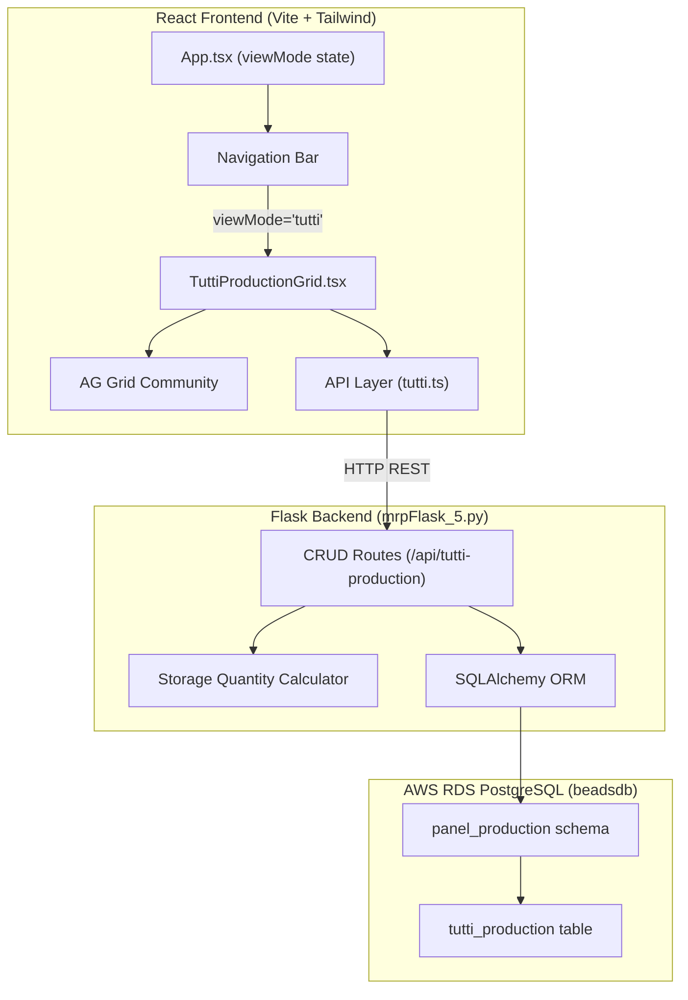
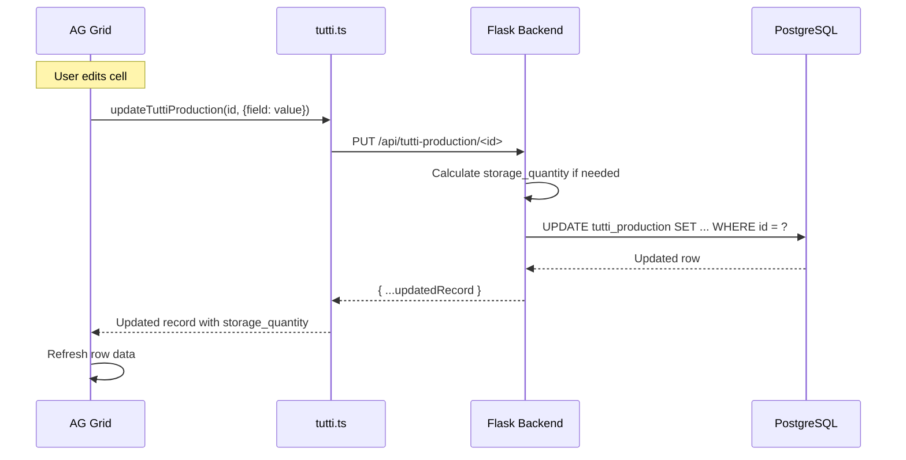

# Design Document: Tutti Production Tab

## Overview

This feature adds a "Tutti-Beads 預建線 . 工單" tab to the Gemini MRP Advanced Planning Simulator. The tab provides an AG Grid-based editable spreadsheet for managing Tutti panel production records, backed by a PostgreSQL table (`panel_production.tutti_production`) on the existing RDS instance.

The implementation spans three layers:
1. **Database** — New schema `panel_production` and table `tutti_production` on the existing RDS PostgreSQL instance
2. **Backend** — New Flask CRUD endpoints in `mrpFlask_5.py` for the `tutti_production` table
3. **Frontend** — New React component using AG Grid Community with inline editing, auto-save, and toolbar actions

## Architecture



### Design Decisions

1. **AG Grid Community (already installed)** — The project already has `@ag-grid-community/core`, `client-side-row-model`, `react`, and `styles` packages. We use these directly rather than introducing a new grid library.

2. **Single-file component** — The `TuttiProductionGrid.tsx` component encapsulates all grid logic (column definitions, event handlers, toolbar) in one file, consistent with the project's existing component pattern (e.g., `MatrixBoard.tsx`, `InsertWorkOrder.tsx`).

3. **Auto-save on cell edit** — Uses AG Grid's `onCellValueChanged` event to trigger PUT requests immediately, matching the "Excel-like" editing UX requirement.

4. **Server-side calculation** — `storage_quantity` is computed on the backend during POST/PUT to ensure data consistency. The frontend also computes it optimistically for immediate UI feedback.

5. **Schema isolation** — Using a dedicated `panel_production` schema keeps this feature's data separate from the existing `schedule` and `public` schemas, avoiding naming conflicts.

## Components and Interfaces

### Frontend Components

#### `TuttiProductionGrid.tsx`

The main component rendered when `viewMode === 'tutti'`.

```typescript
interface TuttiProductionRecord {
  id: number;
  lot_no: string;
  work_order_number: string;
  product_name: string | null;
  production_order_quantity: number | null;
  model_pn: string | null;
  sheet_name: string | null;
  line: string | null;
  well_position: number | null;
  reagent_slot: string | null;
  reagent_name: string | null;
  batch_number: string | null;
  quantity: number | null;
  formula_number: string | null;
  welding_parameter_number: string | null;
  production_quantity: number | null;
  defect_quantity: number;
  qa_inspection: number;
  storage_quantity: number | null;
  labeling_status: string | null;
  diluent_box_status: string | null;
  assembly_status: string | null;
  packaging_status: string | null;
  boxing_status: string | null;
  created_at: string;
  updated_at: string;
  created_by: string | null;
}
```

**Responsibilities:**
- Fetches data from `/api/tutti-production` on mount and when filter changes
- Defines AG Grid column groups and column definitions
- Handles inline cell editing with auto-save (PUT on `onCellValueChanged`)
- Provides toolbar with: filter input, record count, Add/Delete/Refresh buttons
- Manages new row creation and validation before POST
- Handles row selection and batch deletion with confirmation dialog

#### `App.tsx` Changes

- Extend `viewMode` type: `'analysis' | 'board' | 'tutti'`
- Add "Tutti-Beads 預建線 . 工單" button to the navigation bar after "執行看板"
- Conditionally render `<TuttiProductionGrid />` when `viewMode === 'tutti'`

#### `tutti.ts` (API Layer)

```typescript
// API functions for tutti production CRUD
export async function fetchTuttiProduction(workOrder?: string): Promise<TuttiProductionRecord[]>;
export async function createTuttiProduction(data: Partial<TuttiProductionRecord>): Promise<TuttiProductionRecord>;
export async function updateTuttiProduction(id: number, data: Partial<TuttiProductionRecord>): Promise<TuttiProductionRecord>;
export async function deleteTuttiProduction(id: number): Promise<void>;
```

### Backend Routes

Added to `mrpFlask_5.py`:

| Method | Endpoint | Description |
|--------|----------|-------------|
| GET | `/api/tutti-production` | List all records (optional `?work_order=` filter) |
| POST | `/api/tutti-production` | Create a new record |
| PUT | `/api/tutti-production/<id>` | Update an existing record |
| DELETE | `/api/tutti-production/<id>` | Delete a record |

### AG Grid Column Configuration

```typescript
const columnDefs = [
  // Selection checkbox
  { headerCheckboxSelection: true, checkboxSelection: true, width: 50 },
  
  // Group: 工單資訊
  {
    headerName: '工單資訊',
    children: [
      { field: 'lot_no', headerName: '批號', editable: true },
      { field: 'work_order_number', headerName: '工單號碼', editable: true },
      { field: 'product_name', headerName: '產品名稱', editable: true },
      { field: 'production_order_quantity', headerName: '製令數量', editable: true },
      { field: 'model_pn', headerName: 'Model P/N', editable: true },
      { field: 'sheet_name', headerName: '片名', editable: true },
    ]
  },
  
  // Group: 填充/熔接製程
  {
    headerName: '填充/熔接製程',
    children: [
      { field: 'line', headerName: '線別', editable: true },
      { field: 'well_position', headerName: '卡匣位置', editable: true },
      { field: 'reagent_slot', headerName: '藥槽', editable: true },
      { field: 'reagent_name', headerName: '試劑名稱', editable: true },
      { field: 'batch_number', headerName: '批次號', editable: true },
      { field: 'quantity', headerName: '數量', editable: true },
      { field: 'formula_number', headerName: '配方編號', editable: true },
      { field: 'welding_parameter_number', headerName: '熔接參數編號', editable: true },
    ]
  },
  
  // Group: 生產記錄
  {
    headerName: '生產記錄',
    children: [
      { field: 'production_quantity', headerName: '生產數量', editable: true },
      { field: 'defect_quantity', headerName: '不良數量', editable: true },
      { field: 'qa_inspection', headerName: 'QA檢測', editable: true },
      { field: 'storage_quantity', headerName: '入庫數量', editable: false },
    ]
  },
  
  // Group: 後製程
  {
    headerName: '後製程',
    children: [
      { field: 'labeling_status', headerName: '貼標', editable: true },
      { field: 'diluent_box_status', headerName: '稀釋液盒製作', editable: true },
      { field: 'assembly_status', headerName: '組裝', editable: true },
      { field: 'packaging_status', headerName: '包裝', editable: true },
      { field: 'boxing_status', headerName: '裝箱', editable: true },
    ]
  },
];
```

## Data Models

### Database Table: `panel_production.tutti_production`

```sql
CREATE SCHEMA IF NOT EXISTS panel_production;

CREATE TABLE panel_production.tutti_production (
    id                        SERIAL PRIMARY KEY,
    lot_no                    VARCHAR(50) NOT NULL,
    work_order_number         VARCHAR(50) NOT NULL,
    product_name              VARCHAR(100),
    production_order_quantity INTEGER,
    model_pn                  VARCHAR(50),
    sheet_name                VARCHAR(100),
    line                      VARCHAR(10),
    well_position             INTEGER CHECK (well_position >= 1 AND well_position <= 10),
    reagent_slot              VARCHAR(50),
    reagent_name              VARCHAR(100),
    batch_number              VARCHAR(50),
    quantity                  NUMERIC,
    formula_number            VARCHAR(50),
    welding_parameter_number  VARCHAR(50),
    production_quantity       INTEGER,
    defect_quantity           INTEGER DEFAULT 0,
    qa_inspection             INTEGER DEFAULT 0,
    storage_quantity          INTEGER,
    labeling_status           VARCHAR(20),
    diluent_box_status        VARCHAR(20),
    assembly_status           VARCHAR(20),
    packaging_status          VARCHAR(20),
    boxing_status             VARCHAR(20),
    created_at                TIMESTAMP DEFAULT NOW(),
    updated_at                TIMESTAMP DEFAULT NOW(),
    created_by                VARCHAR(50)
);
```

### TypeScript Interface

```typescript
interface TuttiProductionRecord {
  id: number;
  lot_no: string;
  work_order_number: string;
  product_name: string | null;
  production_order_quantity: number | null;
  model_pn: string | null;
  sheet_name: string | null;
  line: string | null;
  well_position: number | null;
  reagent_slot: string | null;
  reagent_name: string | null;
  batch_number: string | null;
  quantity: number | null;
  formula_number: string | null;
  welding_parameter_number: string | null;
  production_quantity: number | null;
  defect_quantity: number;
  qa_inspection: number;
  storage_quantity: number | null;
  labeling_status: string | null;
  diluent_box_status: string | null;
  assembly_status: string | null;
  packaging_status: string | null;
  boxing_status: string | null;
  created_at: string;
  updated_at: string;
  created_by: string | null;
}
```

### Backend Data Flow



## Correctness Properties

*A property is a characteristic or behavior that should hold true across all valid executions of a system — essentially, a formal statement about what the system should do. Properties serve as the bridge between human-readable specifications and machine-verifiable correctness guarantees.*

### Property 1: Ordering Invariant

*For any* set of production records in the database, a GET request to `/api/tutti-production` SHALL return them ordered by `created_at` descending — that is, for every adjacent pair of records in the response array, the first record's `created_at` is greater than or equal to the second's.

**Validates: Requirements 3.1**

### Property 2: Filter Correctness

*For any* set of production records and any `work_order` filter value, a GET request to `/api/tutti-production?work_order=X` SHALL return exactly the records whose `work_order_number` equals X — no more, no less.

**Validates: Requirements 3.2**

### Property 3: Create Round-Trip

*For any* valid production record data (containing at minimum `lot_no` and `work_order_number`), POSTing it to `/api/tutti-production` and then GETting the returned id SHALL yield a record whose fields match the originally submitted data.

**Validates: Requirements 3.3**

### Property 4: Update Correctness

*For any* existing production record and any valid partial update, PUTting the update to `/api/tutti-production/<id>` SHALL result in the record reflecting exactly the updated fields while preserving all non-updated fields, and `updated_at` SHALL be greater than or equal to its previous value.

**Validates: Requirements 3.4**

### Property 5: Delete Removes Record

*For any* existing production record, sending a DELETE request to `/api/tutti-production/<id>` SHALL cause subsequent GET requests to no longer include that record.

**Validates: Requirements 3.5**

### Property 6: Storage Quantity Calculation

*For any* production record with `production_quantity` P, `defect_quantity` D, and `qa_inspection` Q, the `storage_quantity` field SHALL equal P - D - Q whenever P is not null.

**Validates: Requirements 6.1, 6.2**

## Error Handling

### Backend Error Handling

| Scenario | HTTP Status | Response |
|----------|-------------|----------|
| Missing required fields on POST | 400 | `{"ok": false, "error": "缺少必填欄位: lot_no, work_order_number"}` |
| Record not found on PUT/DELETE | 404 | `{"ok": false, "error": "找不到指定記錄"}` |
| Database connection failure | 500 | `{"ok": false, "error": "<exception message>"}` |
| Invalid well_position (outside 1-10) | 400 | `{"ok": false, "error": "卡匣位置必須在 1-10 之間"}` |

### Frontend Error Handling

| Scenario | Behavior |
|----------|----------|
| Auto-save PUT fails | Revert cell to previous value, show error toast |
| POST for new row fails | Remove unpersisted row, show error toast |
| DELETE request fails | Retain row in grid, show error toast |
| Network timeout on GET | Show error state in grid area, allow retry via Refresh button |
| API returns empty array | Show empty grid with "無資料" message |

### Error Notification Pattern

Use a simple toast notification positioned at the top-right of the grid area. Auto-dismiss after 5 seconds. Style consistent with the existing dark theme (`bg-[#FF5252]/10 border border-[#FF5252]/30 text-[#FF5252]`).

## Testing Strategy

### Unit Tests (Example-Based)

- **Navigation**: Verify tab button renders, click switches view, localStorage persistence
- **Column configuration**: Verify column groups, headers, editable flags
- **Toolbar**: Verify Add/Delete/Refresh buttons render and trigger correct actions
- **Error states**: Verify revert on failed save, error notifications display

### Property-Based Tests

Property-based testing is appropriate for the backend CRUD logic and the storage quantity calculation, as these involve pure data transformations with clear input/output behavior across a wide input space.

**Library**: [Hypothesis](https://hypothesis.readthedocs.io/) (Python) for backend properties

**Configuration**:
- Minimum 100 iterations per property test
- Each test tagged with: `Feature: tutti-production-tab, Property {N}: {description}`

**Properties to implement:**
1. Ordering invariant — generate random records, verify GET ordering
2. Filter correctness — generate records with varied work_order_numbers, verify filter
3. Create round-trip — generate valid record data, POST then GET, verify equality
4. Update correctness — create record, generate partial updates, verify fields
5. Delete removes record — create then delete, verify absence
6. Storage quantity calculation — generate random P/D/Q values, verify formula

### Integration Tests

- **Full CRUD flow**: Create → Read → Update → Delete lifecycle
- **Concurrent edits**: Multiple rapid cell edits don't cause race conditions
- **Large dataset**: Grid performance with 500+ rows

### Smoke Tests

- Database schema exists with correct columns
- Flask search_path includes `panel_production`
- AG Grid renders without console errors
